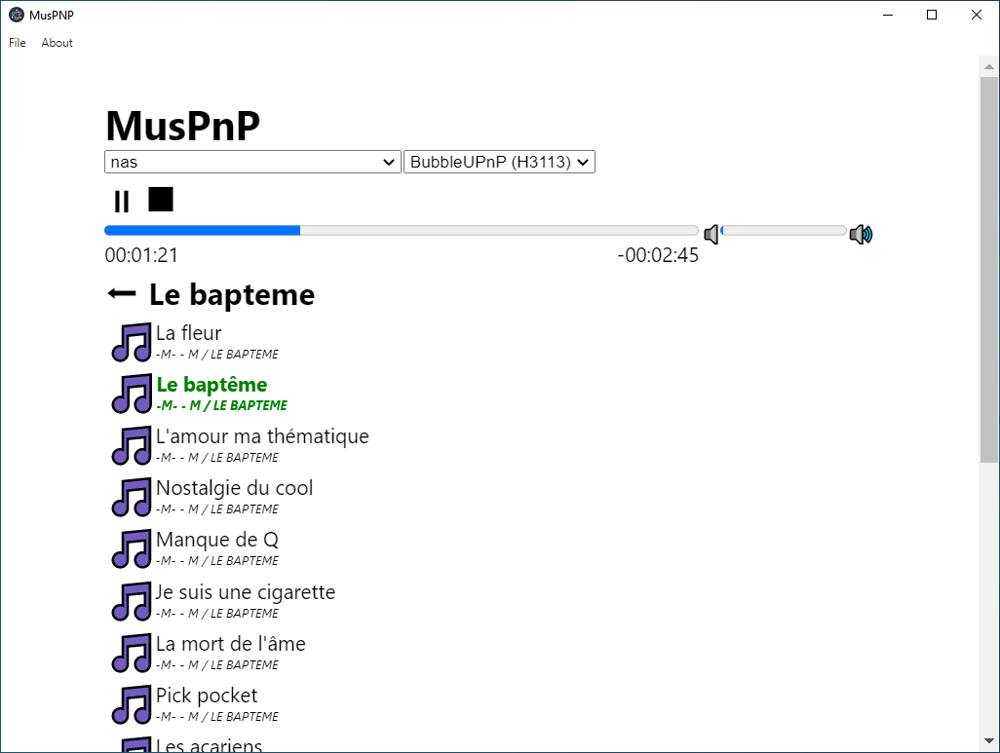

# MusPnP

Play your music on your devices at home.

MusPnP is a UPnP control point, i.e. a remote control for your UPnP compatible devices.

It is meant to be simple and easy to use.

Although it is primarily meant for audio files, you can also use it to browse/watch videos or images. 



## Downloads
* [Windows](https://github.com/phpbg/muspnp/releases/download/1.0.0-rc1/muspnp-1.0.0-rc1.Setup.exe)
* [Linux deb](https://github.com/phpbg/muspnp/releases/download/1.0.0-rc1/muspnp_1.0.0-rc1_amd64.deb)
* [Linux rpm](https://github.com/phpbg/muspnp/releases/download/1.0.0-rc1/muspnp-1.0.0.rc1-1.x86_64.rpm)
* MacOS : builds are not provided, but you should be able to compile it easily (see [steps below](#build-instructions))

## Compatibility

This is a list of servers and renderer known to work. Please send a MR to improve it.

### Renderers
* [Kodi](https://kodi.tv/)
* [BubbleUPnP](https://play.google.com/store/apps/details?id=com.bubblesoft.android.bubbleupnp) (tested on android, volume control is imperfect)
* [gmrender-resurrect](https://github.com/hzeller/gmrender-resurrect)

### Servers
* [ReadyMedia](https://sourceforge.net/projects/minidlna/)
* [BubbleUPnP (serving from android)](https://play.google.com/store/apps/details?id=com.bubblesoft.android.bubbleupnp)
* [PlainUPnP](https://github.com/m3sv/PlainUPnP)

## Missing features
Those features are not yet available:
* Gapless playing
* Keyboard navigation
* SSDP Events handling
* Continuous SSDP discovery (discovery only happens at start right now)

## Debug / logs
Logs are outputed if you run the program from the command line. You can redirect them to a file.
* ex. on windows: `muspnp.exe > logs.txt`

## Build instructions
Install [Nodejs](https://nodejs.org) and [Git](https://git-scm.com/) before proceeding.
```
git clone https://github.com/phpbg/muspnp.git
cd muspnp
npm ci --no-optional
npm run start
npm run make
```

## Credits
This software relies on a lot of great open source tools. Please review them within `package.json` 

## License
This software is released under MIT license. See `LICENSE` file.

Copyright (c) 2021 Samuel CHEMLA